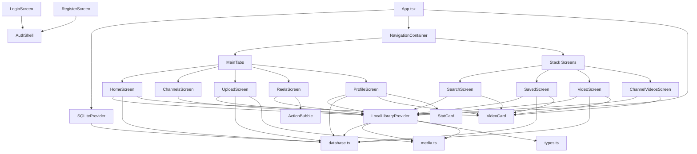
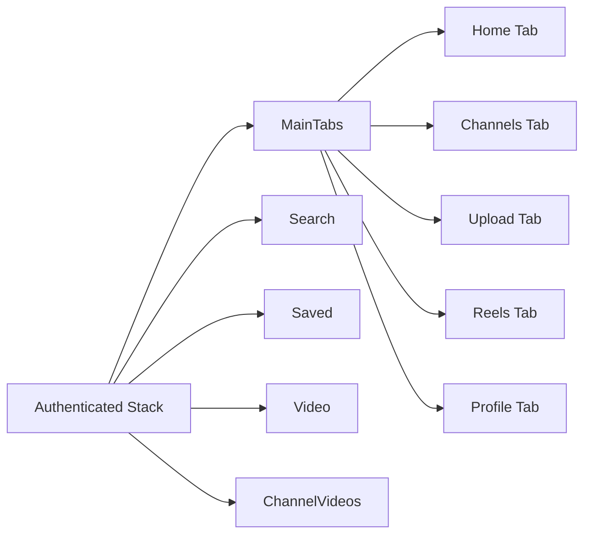
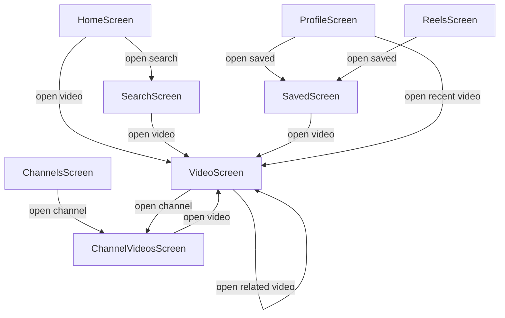
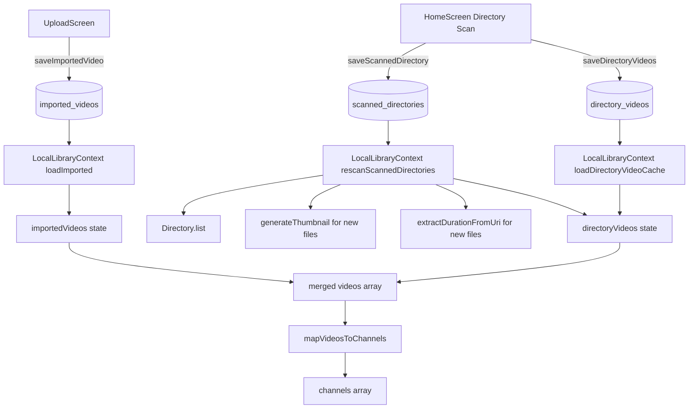
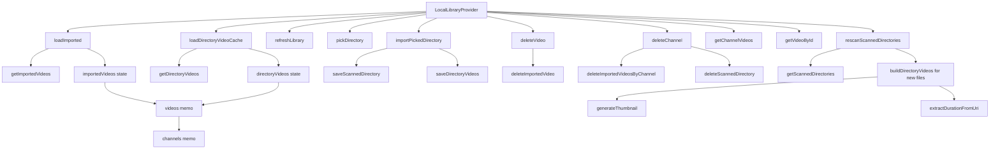
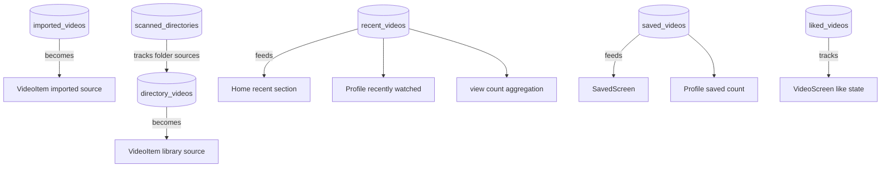
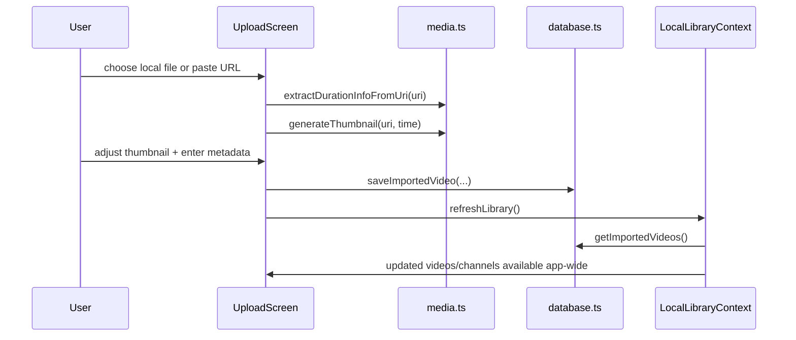
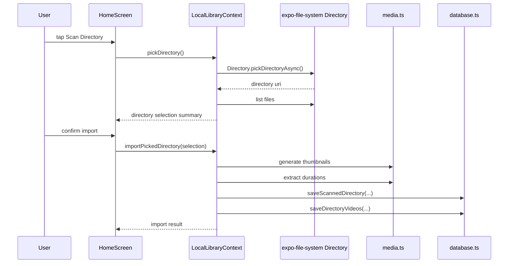
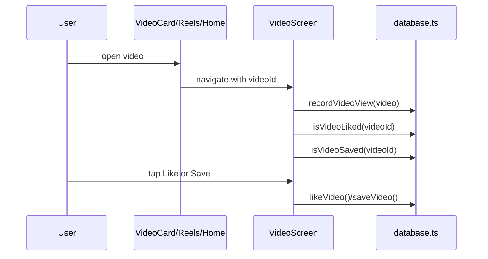
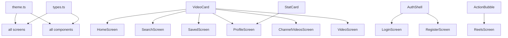

# Streamy Architecture Graph

## Purpose

This document explains how the main parts of `Streamy` connect to each other. It complements `structure.md` by focusing on relationships, data movement, and runtime behavior instead of file-by-file inventory.

## High-Level System Graph

## Navigation Graph

## Screen-to-Screen Interaction Graph

## Data Source Model

The app combines two primary video sources into one unified in-memory library.

## Local Library Context Graph

`LocalLibraryContext` is the central aggregator of the application.

## SQLite Entity Graph

## Video Lifecycle Graph

### Flow A: Imported single video

### Flow B: Directory-based library import

### Flow C: Video playback and tracking

## UI Dependency Graph

## Key Architectural Decisions

### 1. Unified `VideoItem` model

The UI is mostly built around one shared `VideoItem` shape, regardless of whether the video came from:

- SQLite imported rows
- a scanned directory
- saved/liked/watch-history snapshots

This keeps screen rendering simple, but it also means mapping logic is important.

### 2. Virtual channels

Channels are derived from video metadata rather than stored in a dedicated table.

Benefits:

- less schema complexity
- easy to rebuild from current videos

Tradeoff:

- channel identity depends on stable channel naming and ID generation

### 3. Hybrid persistence model

Not every visible video is stored the same way.

- imported videos are persisted as full metadata rows
- scanned directories persist folder identity, while `directory_videos` persists cached video metadata for fast startup
- saved/liked/recent rows store snapshots of video metadata for resilience

### 4. Context-centered app state

Most screens do not talk to each other directly. They coordinate through:

- navigation callbacks
- shared `LocalLibraryContext`
- shared SQLite reads/writes

## Practical Reading Order

If you want to understand the graph in code form, read in this order:

1. `App.tsx`
2. `src/contexts/LocalLibraryContext.tsx`
3. `src/utils/database.ts`
4. `src/screens/HomeScreen.tsx`
5. `src/screens/UploadScreen.tsx`
6. `src/screens/VideoScreen.tsx`
7. `src/screens/ReelsScreen.tsx`

## Change Impact Guide

Use this as a quick mental graph when editing:

- change navigation behavior: `App.tsx`, `types.ts`
- change how videos are loaded globally: `LocalLibraryContext.tsx`
- change DB schema or persistence rules: `database.ts`
- change metadata extraction or thumbnails: `media.ts`
- change the shared visual system: `theme.ts`
- change card rendering across many screens: `VideoCard.tsx`
